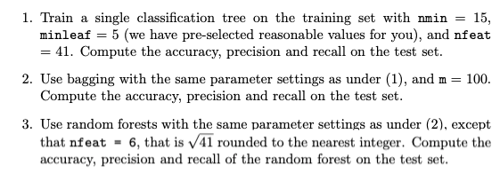

# 2020_data_mining_assignments
* [link to assignment](http://www.cs.uu.nl/docs/vakken/mdm/assignment1-2020.pdf)
* [link to article datasets part 2](https://www.st.cs.uni-saarland.de/softevo/bug-data/eclipse/promise2007-dataset-20a.pdf)

## Part1, tree algorithm/implementation:
- [X] [tree_grow](https://github.com/Vinkage/2020_data_mining_assignments/blob/e650ad27d13b392f5b6535906e36176cb0777650/assignment1.py#L321-L406) functie die het [pseudocode in de slides](./media/tree_grow_pseudo_code.png) volgt
- [ ] tree_grow aanpassen voor n_feat, een paar lines die zeggen dat de hoeveelheid cols die aan exhaustivesplitsearch gegeven worden random uit x gepakt moeten worden
- [ ] tree_grow_b bootstrap versie van tree grow, die een lijst van tree construct door met replacement rows uit x te kiezen

- [X] [tree_pred functie](https://github.com/Vinkage/2020_data_mining_assignments/blob/da8ca975fb9d11d3801fef66344736e675734c42/assignment1.py#L77-L103) met efficiente conditional branches 
- [ ] tree_pred_b een functie die een lijst van tree kan gebruiken om een voorspelling te maken voor rows in een data array x
- [ ] Figure out how we want to compute the confusion matrix (scipy?)
- [ ] Test prediction of single tree on pima indians data with nmin 20 and minleaf 5, check with confusion matrix in [link to assignment](http://www.cs.uu.nl/docs/vakken/mdm/assignment1-2020.pdf)

## Part2, data analysis:
- [ ] Datasets collecten uit de literature
- [ ] Datasets describen, exploren/plotten/formatten als het nodig is

### Official steps

## The report

